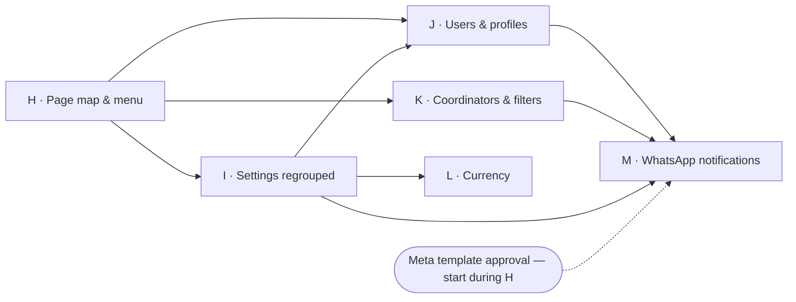

# Roadmap — sellers, roles, modules (and the lead/inbox future)

Agreed 2026-09-24 after feedback from a consultant who works with many clinics:

- In many clinics **sellers never log in**. They tell a **coordinator** what they discussed
  with the patient (treatment plan, price, travel dates); the coordinator enters the patient,
  picks who the seller was, and runs transfers, hotels, visits and payments.
- The coordinator must be able to pick a seller who **is a user**, or **type a name** for one
  who isn't. Coordinators don't need quotes or seller earnings.
- Clinics should be able to **buy parts of the product** (operations only, sales, …).
- Later: WhatsApp / Instagram / Facebook messages and Facebook lead ads flowing into the
  system (Kommo-style), leads → patients end to end.

Status legend: ☐ to do · ◐ in progress · ☑ done

---

## NOW

### Step A — Sellers as records, not accounts ◐ (built 2026-09-24, live on master since 2026-09-25 — waiting for your test)

A seller is someone who gets credit (and commission) for a sale. A login account is someone
who uses the app. Until now these were the same thing; this step separates them.

Design:
- New `sellers` table, one list per clinic: `id, clinic_id, name, profile_id, is_active`.
- **Every clinic account has a seller record with the same id** (`sellers.id = profiles.id`,
  kept in sync by a trigger). All existing `responsible_seller_id` / `earned_by_seller_id`
  values stay exactly as they are — only the foreign keys move from `auth.users` to `sellers`.
  So commission can't change on migration day.
- A seller **without an account** is a seller record with `profile_id = null`.
- Linking a no-account seller to an account later = **merge** it into that account's seller
  record (patients, earned commission and commission rates move over).
- Deleting a login account no longer hands its patients to the admin: the seller record just
  loses its login and keeps its patients and earned commission.
- Patient gets two separate fields: **Seller** (credit/commission) and **Coordinator**
  (the team member who follows up).

To do:
- ☑ SQL: `sellers` table + RLS + profile→seller sync trigger + backfill from profiles
- ☑ SQL: move FKs (`responsible_seller_id`, `visit1/2_earned_by_seller_id`,
      `patient_visits.earned_by_seller_id`, `settings.user_id`) to `sellers`
- ☑ SQL: `patients.coordinator_id` (+ same-clinic guard)
- ☑ SQL: patient insert/reassign rules accept no-account sellers (admins only for now)
- ☑ SQL: `merge_sellers(from, into)` — admin only, bypasses the earned-by lock just for this
- ☑ SQL: admins can set commission rates for no-account sellers
- ☑ Snapshot commission attribution before, compare after (must be identical)
- ☑ Data layer: `getSellers()`, `Seller` type, seller names everywhere come from sellers
- ☑ New patient form: seller picker — pick a seller or type a new name (admins); sellers
      still create patients as themselves
- ☑ Patient page: change seller (with typed name), set coordinator
- ☑ Settings → Team: "Sellers without an account" — add, rename, deactivate, delete (if no
      patients), commission rates, link to an account (merge)
- ☑ Team performance page includes no-account sellers
- ☑ Telegram: new-patient and visit reminders go to the coordinator when the seller has no
      account; cron resolves clinics via `sellers`
- ☑ Follow-up "book visit 2" task goes to the coordinator (or whoever saved) when the seller
      has no account
- ☑ Delete account keeps patients with the (now no-account) seller record
- ☑ Patient phone numbers saved in international format (`+44…`), required country code —
      needed later to match incoming WhatsApp messages to patients
- ☑ Type-check + lint
- ☑ Committed on branch `feature/roles-modules` (not merged to master)
- ☐ Your test — part of the one consolidated checklist at the end

### Decisions for B–F (agreed 2026-09-24)

| Topic | Decision |
|---|---|
| Shipping | Everything on branch `feature/roles-modules`, one commit per step, pushed to GitHub (Vercel preview). Merge to master only after the user tests. DB changes go live as each step is built, so they **must keep the current master code working** (additive columns; old `profiles.role` / `is_admin()` kept in sync). NB: preview deployments use the production database — test with TEST patients. |
| Sales sees | All patients and calendar (as today); only their own commission. |
| Coordinator | Patients, visits, hotels, transfers, payments, prices/extras/discounts, files, tasks; **pick/type sellers and reassign**; **manage drivers & transfer defaults** (not the WhatsApp / driver-message settings — changed 2026-09-25); **Accounting page**. No quotes, no earnings, no commission settings, no team management, no deleting patients. |
| Accountant | Accounting page, record payments, **every seller's earnings** (Team page). Patients read-only otherwise. No settings, no quotes. |
| Modules | Per-clinic toggles in /platform, **prefilled by plan** (Trial = all, Starter = Operations, Pro = all, Custom = manual), still editable by hand. |
| Discount | **Per visit, £ or %**, optional reason. Comes off that visit's total (treatment + extras). **Anyone who can edit money** may give one, no cap; always logged. |
| Files | **Plain list** per patient (no categories, not tied to visits). Private storage, clinic-only, expiring links, 20 MB per file. |

### Step B — Roles and permissions ◐ (built 2026-09-24, live on master since 2026-09-25 — waiting for your test)
Built as designed below. Notes:
- Catalog in `permissions` / `role_permissions`; `has_permission()`, `my_permissions()`,
  `member_roles()` (support mode → viewed-as member's roles, admin when viewing as nobody).
- Sales keeps two own-record rules outside the catalog, exactly as before: the responsible
  seller can reassign and delete their own patient.
- Prices (visit expected amounts) additionally need `money.edit` (DB trigger). In
  `clinic_config`, `drivers.manage` may write only the transfer-default columns and
  `messaging.manage` only the driver-message / WhatsApp columns (trigger).
- 2026-09-25 (after the user's review): WhatsApp driver-message settings (app / API / off, API
  details, templates) split out of `drivers.manage` into **`messaging.manage`, Admin only** —
  coordinators see the setting but can't change it. The Privacy card ("hide commission
  figures") in Settings → Account only shows to people with `earnings.own` / `earnings.all`.
- Adding team members now needs `team.manage` (the UI already only showed it to admins).
- Settings → Team: role tick-buttons per member and on the add form; last-admin and
  own-roles guards are in the database.
- `profiles.roles text[]` (multi-role: `admin`, `sales`, `coordinator`, `accountant`).
  Backfill: admin → {admin, sales}; seller → {sales} — nobody's access changes. Keep the old
  `profiles.role` column in sync by trigger (admin if 'admin' in roles, else seller) so the
  live master code and `is_admin()` keep working.
- `role_permissions (role, permission)` table = the catalog; helper `has_permission(uid, perm)`
  (security definer; in support mode the viewed-as member's roles, still under support's
  read-only lock).
- Permissions: `patients.view`, `patients.edit`, `patients.delete`, `sellers.assign`
  (pick/type any seller, reassign), `sellers.manage` (seller list + rates), `payments.record`,
  `money.edit` (prices, extras, discounts), `transfers.manage`, `drivers.manage`,
  `messaging.manage` (WhatsApp driver-message settings), `quotes.use`, `earnings.own`, `earnings.all`, `accounting.view`, `files.manage`,
  `tasks.use`, `team.manage`, `settings.clinic`, `activity.view`. Room for `leads.*` /
  `inbox.*` later.
- Admin = all. Sales = exactly what a seller can do today (check every current seller path).
  Coordinator / Accountant per the table above.
- Seller record active only for accounts with the Sales role (others hidden from pickers).
- Enforced in RLS (replace `is_admin()` checks where a permission fits), server actions
  (`requirePermission`), page guards and the nav (desktop + mobile More menu).
- Settings → Team: role checkboxes per member instead of Promote/Demote; roles chosen when
  adding a member. Guards: a clinic can never lose its last admin; nobody edits their own roles.

### Step C — Modules per clinic ◐ (built 2026-09-24, live on master since 2026-09-25 — waiting for your test)
Built as designed below. Notes: `sellers.manage` is core (the seller list stays with Sales
off; only the rates hide). Module switches sit in /platform → clinic → Plan & billing, next
to the plan picker that prefills them. Operations off also hides the flights/hotel card and
the dashboard's "Logistics not arranged" card.
- `clinics.modules text[]`, default all three: `operations`, `sales`, `accounting` (`inbox`
  reserved). Each permission belongs to a module or to core (patients, payments, tasks, files,
  team, settings are core).
- /platform clinic page: three switches + plan picker that prefills them.
- Effective permission = role permission AND module on — inside `has_permission()` too.
- Sales off: no Quotes, Earnings, commission settings, commission on the Team page, rates on
  the seller list; the Seller field stays (reports by seller). Operations off: no Transfers
  page, driver settings or transfer/hotel cards. Accounting off: no Accounting page.

### Step D — Activity log gaps ◐ (built 2026-09-24, live on master since 2026-09-25 — waiting for your test)
Most gaps had already been closed on master (quotes, tasks, settings, profile, Telegram code).
Added: the first-sign-in name, Telegram link completed (webhook), role changes. TODO.md trimmed.
- Close every gap listed in `TODO.md` (quote lifecycle, commission/branding/system/dashboard
  settings, tasks, profile name/password, Telegram send + link code), then trim TODO.md.

### Step E — Discounts ◐ (built 2026-09-24, live on master since 2026-09-25 — waiting for your test)
Built as designed below: `visitDiscount()` / `visitExpectedTotal()` in `src/lib/commission.ts`
are the one place a discount becomes money. Money card: Price → Extras → Discount → Owed.
Also on the operations sheet, the Telegram visit message ("İndirim") and the CSV export.
Changing a discount needs `money.edit` (DB trigger); set/remove is logged.
- Columns: `visit1_/visit2_discount_type` ('amount' | 'percent'), `_discount_value`,
  `_discount_reason` on patients; `discount_type/value/reason` on patient_visits.
  Discount = % of (price + extras) or the amount, never more than the total.
- One helper (`visitDiscount`) used everywhere a visit's total is computed. Affected:
  `visitExpectedTotal` / `treatmentTotal` (commission.ts → expected commission); owed / still
  due / due-now badges (balance.ts); Money card (Price → Extras → **Discount** → Owed →
  Payments → Still due); Visits at a glance; patient header badges; patients list and CSV
  export; Accounting open balances; dashboard cards (upcoming value, avg treatment value,
  highest value patient); Telegram visit message ("İndirim"); confirmation letter and
  operations sheet; "mark completed" mismatch check; History / activity log.
- Paid commission is unaffected by design (actual = sum of payments).

### Step F — Patient files ◐ (built 2026-09-24, live on master since 2026-09-25 — waiting for your test)
Built as designed below. Uploads go browser → Storage through signed upload URLs issued by a
server action (Vercel's request-size limit rules out uploading through the app), then the
action records the rows after checking the files arrived. Support opening a file is written
to the support access log (`record_file_opened`).
- Private Storage bucket `patient-files`, path `{clinic_id}/{patient_id}/{uuid}-{name}`;
  storage RLS by clinic folder; opened via 1-hour signed links. 20 MB per file; images, PDF,
  Office docs, text.
- `patient_files` table (id, clinic_id, patient_id, name, path, size, mime, uploaded_by,
  created_at). Deleting a patient removes their files from storage too.
- Patient info tab: "Files" card — upload (several at once; phone camera works), list with
  name / size / who / when, open, rename, delete (uploader or admin). Logged in History.

### Finish ◐ — SQL applied, merged; your test remaining
- ☑ **Apply the SQL** — applied 2026-09-25 through the Management API (dry run, then twice);
  verified roles, seller records, 43 role permissions, modules, `my_permissions()` per role,
  RLS patient counts, identical commission attribution, `patient-files` bucket, discount
  columns. Re-applied the same day with `messaging.manage` (now 44 role permissions; only the
  admins gained it; coordinator refused on WhatsApp columns, still allowed on transfer
  defaults; commission identical). For reference, the section is everything in `supabase/schema.sql` from the
  line `-- ROLES AND PERMISSIONS (roadmap step B)` down to just before
  `-- ONE-TIME MANUAL STEP`. It is safe to run twice and keeps the current master code
  working (tested on a local Postgres copy of the schema: backfill, re-run, every role, support
  mode, modules, discount checks, file policies). Do it **before** opening the preview — the
  new code expects the new columns. (Running the whole file from the top is not safe to
  re-run: the oldest sections use plain `create policy`.)
- ☐ Your test — the checklist below, on the Vercel preview of `feature/roles-modules`, with
  TEST patients only (the preview uses the production database).
- ☑ Merged to master 2026-09-25 (fast-forward to 25bcbab) and deployed to production.

#### Consolidated test checklist (steps A–F)

Setup: in Settings → Team & clinic, add three TEST accounts (or reuse ones): one with only
**Coordinator**, one with only **Accountant**, one with only **Sales**. Keep your own admin.

Sellers without an account (A)
1. As admin, New patient → Seller → "+ New seller (no account)" → type "TEST Ahmet". Save.
   You are shown as the coordinator; Settings → Team & clinic lists TEST Ahmet.
2. Settings → Sellers without an account: rename, set commission, deactivate/reactivate.
3. Team page shows TEST Ahmet with "No account".
4. Link TEST Ahmet to an account (merge) → the patient moves to that account.
5. Phone numbers on the patient save as +44… (country code required).

Roles (B)
6. Team card: tick-buttons per member; you can't change your own; removing the last admin is refused.
7. **Sales** account: sees Patients, Calendar, Quotes, Tasks, Transfers, Earnings, Accounting;
   no Team page, no clinic settings. Can add a patient only as themselves; can reassign/delete
   only their own patients. Exactly like a seller today.
8. **Coordinator** account: sees Patients, Calendar, Tasks, Transfers, Accounting; no Quotes,
   no Earnings, no Commission tab. New patient → can pick any seller or type a new one;
   can reassign any patient; can't delete patients. Settings → Transfers: can change the
   transfer defaults and drivers, but **Driver messages (WhatsApp app / API / off) is
   read-only** ("Only an admin can change this"). Settings → Account has **no Privacy card**.
   Team & clinic tab is hidden.
9. **Accountant** account: sees Patients (no edit buttons, no + Visit, no transfer actions),
   Accounting, Team page (every seller's earnings, no activity); can record/edit payments but
   not extras, prices or discounts.
10. Phone (narrow window): the bottom bar and More menu show only the allowed pages.
11. Support mode (platform): view as the Sales account → the app shows the Sales menus.

Modules (C)
12. /platform → the clinic → Plan & billing: switch plan to Starter → only Operations ticked;
    Save. In the clinic: Quotes, Earnings, commission settings and Accounting are gone; the
    Team page shows only activity; seller list has no rates.
13. Untick Operations (Custom): Transfers page, Settings → Transfers, flights/hotel and
    transfer cards on the patient and the dashboard's "Logistics not arranged" are gone.
14. Set it back to Pro (all three) afterwards.

Activity log (D)
15. Change a TEST member's roles → Activity shows "changed X's roles (Sales → Coordinator)".
16. Link Telegram from Settings → Activity shows "connected their Telegram".

Discounts (E)
17. TEST patient, visit 1 price £1,000 + one extra £100 → Money card: + Discount → 10% "TEST".
    Owed shows £990; Still due, the visit badge, Patients list, Accounting and the patient's
    header all use £990.
18. Change it to £ 2,000 → owed becomes £0 (never negative). Remove it → back to £1,100.
19. Earnings: expected commission follows the discounted amount; paid commission unchanged.
20. Telegram → send visit 1 → message has an "İndirim" line. Operations sheet shows the
    discount. Patient → Export to CSV has a "Visit 1 Discount" column.
21. History tab shows "gave … a discount" / "removed a discount".

Patient files (F)
22. TEST patient → Patient info → Files → + Upload: pick two files (a photo and a PDF). Both
    listed with size, who, when. On a phone, the picker offers the camera.
23. Open (new tab) and Download work; the link stops working after an hour.
24. Rename and delete your own file. As the Sales account, a file you (admin) uploaded has no
    Rename/Delete. The Accountant can open but not upload.
25. A file over 20 MB, or a .zip, is refused with a message.
26. Delete the TEST patient → their files are gone from Storage (Supabase → Storage →
    patient-files) too.

---

## Step G — roles page (live on master)

### Step G — Roles page: see, then customise, what each role can do ◐ (built 2026-09-25, live on master since 2026-09-25 — waiting for your test)

Built on its own branch, stacked on `feature/roles-modules`: merge A–F first, then this.

**Decisions (2026-09-25, from the user's answers)**
- Branch `feature/roles-page`; SQL applied to production as it was built (old keys stay valid,
  so master and the A–F preview keep working).
- **No money-view level**: whoever sees a patient sees their amounts.
- **Roles only** — no per-person extra or removed permissions.
- The Roles page has its own levels **`roles.view` / `roles.edit` / `roles.delete`**. Whoever the
  admin gives `roles.edit` may change roles **however they want** (including roles they hold) —
  no "only grant what you hold" rule. Kept only the lock-out guards: **Admin always has
  everything and can't be edited**; a clinic can't lose its last admin; a role in use can't be
  deleted.
- Being a seller (seller picker, commission) stays tied to the **Sales** role.
- Everyone sees **"What I can do"** (Settings → Account); the full grid needs a `roles.*` permission.
- **Superadmin can do everything**: edits the default templates in **/platform → Roles**; in
  support mode acts as the clinic's admin (view as nobody) — MFA, "Unlock editing" and the
  support log stay.
- A permission added to the catalog later reaches clinics' **customised built-in roles** with
  its default; custom roles never gain anything by themselves.

**G0 — finer permissions (31 keys; access unchanged on migration day)**

| Area | Permissions |
|---|---|
| Patients | `patients.view` · `patients.edit` · `patients.delete` · **`patients.export`** (CSV: Data tab + single patient) |
| Sellers | `sellers.assign` · `sellers.manage` |
| Money | `money.edit` (prices, extras, discounts) · `payments.record` (add) · **`payments.edit`** (edit/delete) |
| Files | **`files.view`** · `files.manage` (upload; rename/delete own) · **`files.delete`** (anyone's — was tied to `patients.delete`) |
| Transfers | `transfers.manage` · `drivers.manage` · `messaging.manage` |
| Sales | `quotes.use` · `earnings.own` · `earnings.all` |
| Accounting / Tasks | `accounting.view` · `tasks.use` |
| Team | **`team.view`** (list + emails, read-only) · `team.manage` · **`team.delete`** · `activity.view` |
| Roles | **`roles.view`** · **`roles.edit`** · **`roles.delete`** |
| Clinic settings | **`settings.branding`** · **`settings.telegram`** · **`settings.money`** (System tab) |

`settings.clinic` is kept as a hidden **legacy** key (Admin only) until A–F and G are both on
master; nothing on this branch checks it. Defaults: the three split-off keys (`patients.export`,
`payments.edit`, `files.view`) went to every role that could already do those things; every
other new key is Admin only. Verified: every member's `my_permissions()` = before + those.

**G1 — seeing it**: Settings → **Roles** tab (grid: permissions grouped, one column per role,
member counts, "module off" greyed); Settings → Account → **What I can do**; Team card →
**What can they do?** per member (union of their roles).

**G2 — changing it**
- Tables: `clinic_roles` (custom roles + a row per customised built-in) and
  `clinic_role_permissions`; `role_permissions` = the platform's default templates.
  `role_has_permission()` → Admin: all; clinic row: the clinic's list; else: the template.
  `has_permission()` / `my_permissions()` use it; `member_clinic_id()` handles support mode.
- Writes only through `save_clinic_role` / `reset_clinic_role` / `delete_clinic_role`
  (security definer; permission + support read-only checks inside). `profiles.roles` is checked
  by the `profiles_validate_roles` trigger (built-ins or the clinic's own custom roles).
- The migration **no longer wipes** `role_permissions`: only keys new to the catalog get
  their defaults (templates + customised built-ins).
- UI: + New role, Edit (name for custom roles; ticks with "default" markers on built-ins),
  Reset (customised built-in), Delete (custom, unused). Team card tick-buttons include custom
  roles. Activity: "created / changed / reset / deleted the role …" with + / − keys.
- /platform → **Roles**: edit the Sales / Coordinator / Accountant templates; shows how many
  clinics customised each; logged in the platform audit log ("Changed role template").

Tested on production in rolled-back transactions: create; duplicate name, Admin role, legacy key
and unknown member role refused; a held role can't be deleted; customised Coordinator shrinks and
Reset restores it; a seller without `roles.edit` is refused; a seller with `roles.edit` edits
Accountant but not Admin; a new catalog key reaches a customised built-in but not a custom role;
settings sections (coordinator: driver defaults yes, branding and money no). Commission
attribution identical. UI: created and deleted a "TEST Receptionist" role as admin (the delete
went through the same database function directly — the browser tool couldn't click through the
confirm box). The /platform Roles page was type-checked but not opened (needs the superadmin
login with two-factor).

To do:
- ☑ G0 keys, mapping, settings split, file/payment/export/team checks
- ☑ G1 Roles tab, What I can do, What can they do?
- ☑ G2 tables, functions, trigger, no-wipe seeding, UI, activity log, /platform templates
- ☑ Snapshot `my_permissions()` before/after; type-check + lint (only the two old errors)
- ☐ Your test — checklist below
- ☑ Merged to master after A–F (fast-forward to 5bdda5f) and deployed
- ☐ After both are on master: drop the legacy `settings.clinic` key

#### Test checklist (step G)
27. Settings → Account → **What I can do** lists your permissions in plain words; as the
    Coordinator it shows only theirs (no Quotes/Earnings, no settings).
28. Settings → **Roles**: grid shows Admin / Sales / Coordinator / Accountant with ticks and
    member counts. On Starter (Operations only) the Sales/Accounting rows are greyed "module off".
29. **+ New role** "TEST Receptionist": patients view + tasks → appears as a column and as a
    tick-button on each Team card. Give it to the Coordinator TEST account → their "What can
    they do?" now includes both roles' permissions.
30. Try deleting TEST Receptionist while someone has it → refused ("Take this role off …").
    Untick it on the member, delete → gone. Activity shows created / deleted.
31. **Edit Coordinator**: untick "Transfers page …" → Save → the column shows "Changed"; as the
    Coordinator: no Transfers page. **Reset** → back to default, Transfers returns.
32. Give **Sales** "Create roles and change what roles can do" → a Sales account sees the Roles
    tab and can edit Accountant, but Admin has no Edit. Take it away again.
33. Coordinator: Settings → Team & clinic shows no branding / Telegram cards; System tab hidden.
    Give Coordinator "Team Telegram group" → only that card appears and saving it works. Reset.
34. Payments: untick "Edit and delete payments" on Accountant → the Accountant can still
    + Record payment, but the payment row menu is gone. Reset afterwards.
35. Files: as Sales, a file you (admin) uploaded has no Rename/Delete; give Sales "Rename and
    delete anyone's files" → it appears. Reset afterwards.
36. Export: untick "Export patients to a CSV file" on a role → the Data tab and the patient's
    "Export to CSV" menu item disappear for that role.
37. /platform → **Roles**: change the Accountant template (e.g. untick Tasks) → a clinic that
    hasn't customised Accountant follows it at once; the audit log shows "Changed role
    template". Put it back.

---

## Open issues & small fixes (before or alongside the plan)

### ⚠ WhatsApp delivery status never updates ("Sending…" forever) — needs the Meta setup (user, later)

Found 2026-09-25. Not a code bug: **Meta has never called our webhook.**
- Database: all 3 driver messages sent through the API are still at "accepted" (shown as
  "Sending…"); no sent / delivered / read ever arrived.
- Vercel logs: no requests to `/api/whatsapp/webhook` in 48 h (production or preview).
- Our endpoint is reachable (`https://dentalseller.vercel.app/api/whatsapp/webhook`: wrong verify
  token → 403, POST → 200).
- Meta: the phone number (Thera Dental Clinic, Cloud API, connected) reports **no webhook
  configuration**.

**To do in Meta (developers.facebook.com, app ID `2507097539775020`)** — the user can't reach it
right now:
1. WhatsApp → Configuration → Webhook → Edit:
   - Callback URL: **`https://dentalseller.vercel.app/api/whatsapp/webhook`** (not the localhost
     one Settings shows when opened on localhost),
   - Verify token: from Settings → Transfers → Driver messages → Delivery status. Verify & save.
2. Webhook fields: subscribe to **messages**.
3. Check the App Secret saved in our settings matches App settings → Basic (otherwise Meta's
   calls arrive but are refused with 401 — visible in the Vercel logs).
4. Send a new driver message → it should go Sent → Delivered → Read within seconds. (The 3 old
   ones stay as they are — Meta doesn't resend old statuses.) Still nothing → check whether the
   Meta app is still in Development mode, and the Vercel logs.

### Small fixes (suggested 2026-09-25, not started)
- ☐ Status label: "accepted" reads **"Sent to WhatsApp"**; no report after ~10 min → admins see
  "No delivery report — check the webhook in Settings → Transfers" instead of "Sending…" forever.
- ☐ Settings → Transfers shows the **production** callback URL, never localhost.

### Basic message history — interim, until step M (suggested 2026-09-25, not started, ~1 day)
Today only the **latest** API message per transfer keeps a status, the text isn't saved, replies
are ignored, and WhatsApp-app sends leave no trace beyond an activity entry.
- ☐ **Message log** table: every WhatsApp message we send — recipient (driver / member), transfer
  and patient, the exact text / template, who sent it, `wa_message_id`, each status with its time
  (sent / delivered / read / failed + reason). App-mode sends logged as "opened in WhatsApp" with
  the text (no delivery report possible there). The webhook updates the log as well.
- ☐ Transfer row: clicking the status opens that transfer's message history (oldest → newest).
- ☐ Patient History tab lists those messages.
- ☐ Failed messages → a warning for admins on the Transfers page.
- ☐ Kept 12 months, then deleted by the daily job.
- Left for step M: replies / inbox, a full message-log page with filters, coordinator messages —
  step M builds on this same log.
- Limits: someone with read receipts off only ever shows "Delivered"; WhatsApp-app mode can never
  be tracked.

---

## NEXT — the plan (ordered 2026-09-25)

Seven notes from the user (profiles, WhatsApp instead of Telegram, a new menu, a clearer
settings page, a users page apart from seller performance, a real activity page, currency,
plus the coordinator filters noted earlier), put in the order that avoids doing work twice.

### At a glance

| # | Step | What you get | Size | Needs |
|---|---|---|---|---|
| 1 | **H — Page map & new menu** | Left sidebar with icons that opens on hover; every page and setting has a decided home | M | — |
| 2 | **I — Settings, regrouped** | "My settings" vs "Clinic settings", each clinic area on its own page, a settings search | M | H |
| 3 | **J — Users, profiles, performance, activity** | A profile for every user (with phone), a Users page for admins, Sales performance and Activity as their own pages | L | H, I |
| 4 | **K — Coordinators & filters** | Coordinator column and picker; Seller + Coordinator filters on Patients, Dashboard, Calendar, Transfers; saved personal defaults | M | H |
| 5 | **L — Currency** | One main currency per clinic (Thera: GBP) plus optional deal currencies per patient (e.g. EUR), converted with the rate used; GBP-only clinics see no change | L | I |
| 6 | **M — Notifications on WhatsApp** | Reminders and visit info to each person's own WhatsApp; Telegram removed | L | I, J, K + Meta approval |

**Why this order**
- **Menu and page map first.** Four of the notes are about *where things live* (settings,
  users, performance, activity, currency, notification settings). Deciding that once, up front,
  means no page gets built in one place and then moved.
- **Settings before the features that add settings.** Currency and WhatsApp notifications both
  add settings; they should land in the new structure, not the old tabs.
- **Profiles before WhatsApp.** Messages go to each person's phone number — that lives in the
  profile.
- **Coordinators before WhatsApp.** "Send it to the coordinator" needs the coordinator to be
  visible and correct on every patient.
- **Currency before a second, non-£ clinic signs up** — can move earlier if one does.
- **WhatsApp last, but its paperwork first.** Every business-initiated WhatsApp message must be
  a Meta-approved template, and approval can take days to weeks — draft and submit the templates
  while H–L are being built.

Every step keeps the rules that worked for A–G: its own branch, SQL applied to production only
if it keeps master working, one consolidated test checklist at the end, merge after your test.

---

### Step H — Page map & new menu ✅ (built, awaiting your check)

**The page map** (decided in this step, reviewed by you before building):

| Group | Pages | Who sees it |
|---|---|---|
| Work | Home · Patients · Calendar · Transfers · Tasks | by permission, as today |
| Sales | Quotes · Earnings (mine) · **Sales performance** (every seller) | `quotes.use`, `earnings.own`, `earnings.all` |
| Money | Accounting | `accounting.view` |
| Admin | **Users** · **Activity** · **Settings** | `team.view` / `activity.view` / settings permissions |
| You (bottom of the menu) | **My profile** · My settings · Sign out | everyone |

(Today's Team page splits into **Sales performance** and **Users**; Activity gets its own menu
entry — step J builds those pages, this step gives them their place.)

**The menu (desktop / tablet)**
- A slim **icon rail on the left** (about 64 px). Hovering (or keyboard focus) **opens it over
  the page** to about 240 px with the names and group labels — the page doesn't jump.
- When the pointer leaves, the names **fold away after a short delay** (the note says 3 s — we'll
  try 3 s and tune it by feel), so a quick pass over the menu doesn't make it flicker.
- A **pin** at the bottom keeps it open for people who prefer names; remembered per user.
- Active page highlighted; small badges where useful (e.g. overdue tasks).
- Clinic name / logo at the top; global patient search moves to a top bar with the profile
  avatar menu on the right.
- Every link still follows permissions and modules, exactly as the current menu does.

**Phone**: the bottom bar stays (Home, Patients, Transfers, Tasks + More); "More" becomes a
sheet with the same groups as the sidebar.

**Decided from the mockup** (https://claude.ai/artifact/NfNozMN2sLgGZwDsZ4TgpL):
- My profile / My settings / Sign out live in the **avatar menu** (top bar, right); the bottom
  of the rail holds only the pin. On phones they sit at the bottom of the "More" sheet.
- Fold delay **1 s**. Opening waits ~120 ms so passing over the rail doesn't open it.
- **Clicking a page closes the menu at once** (unless pinned); Escape closes it too.
- Badges for now: **Tasks** (overdue, red) and **Transfers** (to confirm, teal). Closed rail
  shows a dot; open rail shows the number.
- Look: current app palette (white / slate, teal active pill), existing icons; group labels
  when open, short divider lines between groups when closed.

To do:
- ✅ Page map written out and approved (Users / Sales performance / Clinic settings point at today's pages until steps I and J)
- ✅ Sidebar: rail, hover-open overlay, delayed fold, pin (saved per user, cookie), groups, badges
- ✅ Top bar: page title, patient search (Ctrl K), avatar menu; phone "More" sheet grouped the same way
- ✅ Accessibility: keyboard, focus, tooltips on the rail, reduced-motion
- ☐ Test checklist

### Step I — Settings, regrouped ✅ (built, awaiting your check)

Problem: one long page of tabs where personal and clinic-wide settings sit side by side, and
every new feature adds another card.

**Concept**
- **Two places, clearly named:**
  - **My settings** (everyone; from the profile menu): display (privacy, celebrations,
    dashboard cards, "approx. in …" currency), my notifications (from step M).
  - **Clinic settings** (Admin area; each section needs its own permission from step G).
- **Clinic settings get a left-hand section list** (vertical, like the menu), one page per
  section instead of stacked cards:

  | Section | Contains | Permission |
  |---|---|---|
  | Clinic | name, logo, contact details (letters and quotes) | `settings.branding` |
  | Team & roles | roles grid and editor (users themselves move to the Users page) | `roles.*` |
  | Sales & commission | commission tiers, sellers without an account and their rates | `sellers.manage` |
  | Money | **currency** (step L), card surcharge, costs before commission | `settings.money` |
  | Operations | transfer companies, drivers, default drivers | `transfers.manage` / `drivers.manage` |
  | Messaging | WhatsApp connection + notification rules (step M) | `messaging.manage` |
  | Data | export | `patients.export` |

- A section the clinic's modules don't include isn't listed; a section someone has no
  permission for isn't listed either (same rule as the menu).
- **Search box** at the top of Clinic settings ("surcharge", "logo", "WhatsApp") jumps to the
  right section — this is what keeps it usable as settings grow.
- Each section saves on its own with a clear "Saved" state; nothing half-saved across tabs.
- Old links (`/settings?tab=…`) redirect to the new sections.

To do:
- ✅ My settings page (`/settings`); Clinic settings with section list, one route per section (`/settings/clinic/<section>`)
- ✅ Every existing card moved to its section; old `/settings?tab=…` links redirect
- ✅ Settings search (static index of section + setting names)
- ☐ Test checklist

### Step J — Users, profiles, sales performance, activity ✅ (built on branch `step-j-users`, awaiting your check)

**My profile** (every user, from the profile menu)
- Name, email (change with confirmation), **phone number** (international format — used for
  WhatsApp in step M), password, photo (optional).
- My roles (read-only) and "What I can do" (moves here from Settings → Account).

**Users** (admin area, `team.view` to see, `team.manage` / `team.delete` to change)
- A table of every account: name, email, phone, roles, status (active / invited / inactive),
  last active. Search and filter by role and status.
- Click a user → their page: profile details, roles (tick-buttons), reset password,
  deactivate, delete, their recent activity, their patients as seller and as coordinator.
- Add user moves here from Settings. Sellers without an account get a tab here too.

**Sales performance** (was the Team page; `earnings.all`)
- Every seller's sales and commission by month, including sellers without an account —
  unchanged content, clearer name, no activity feed mixed in.

**Activity** (own menu entry; `activity.view`)
- Filters: **person**, **category** (patients, money, transfers, team, settings, roles…),
  **patient**, **date range**, **done by support**; free-text search in details.
- Filters live in the URL (shareable), paging instead of a fixed limit, export to CSV.
- A user's page and a patient's History tab reuse the same feed, pre-filtered.

**Decided while building My profile + Users (2026-09-25)**
- **Email change** is confirmed with the current password and applies at once (the app sends
  no email yet). Switch to Supabase's two-link email confirmation once custom SMTP is set up.
- **Sellers without an account** live on Users → "Sellers without an account" (`sellers.manage`);
  the Clinic settings section "Sales & commission" is gone (`/settings/clinic/sales` →
  `/users?tab=sellers`, `/settings/clinic/users` → `/users`).
- **Deleted users stay recognisable** in the history: their entries keep the id in
  `activity_log.former_actor_id` and show as "Leo (deleted user #1a2b3c)"; the Activity person
  filter still finds them.
- **Status** needs no column: inactive = switched off, invited = never signed in, otherwise
  active. **Last active** = latest of the app heartbeat (`user_presence`) and the last sign-in.
- **Deactivate** also blocks the login (Supabase ban): no new sign-in, no session refresh; an
  open session shows "Your account has been deactivated". Patients, seller record and
  commission stay. Reactivate lifts the ban. (Accounts deactivated before this change aren't
  banned yet — they get the same screen, and deactivating/reactivating once applies it.)
- **Delete**: patients they sold stay with their seller record (now without an account);
  patients they coordinate can be handed to another active member in the delete dialog
  (otherwise they get no coordinator); quotes/tasks go to whoever deletes; the last active admin
  can't be deleted; typing DELETE confirms.
- **Photo**: private bucket `avatars`, one fixed file per person (`{clinic}/{user}`), shrunk to
  256 px in the browser; only clinic members can see it, only the owner can change it.
- Team managers can edit a member's name and phone on their page (e.g. for someone who rarely
  signs in). Nobody changes their own roles, deactivates or deletes themselves.

SQL (applied 2026-09-25): `profiles.phone` (+ format check, unique per clinic),
`profiles.avatar_updated_at`, bucket `avatars` + 4 storage policies,
`activity_log.former_actor_id`. No change to existing policies or triggers.

To do:
- ✅ Profile page (`/profile`): name, photo, sign-in email, phone (international format), password, my roles, "What I can do"
- ✅ Users list (`/users`: search, role and status filters, sellers-without-account tab) + user page (`/users/<id>`: details, roles, reset / deactivate / delete, recent activity, patients as seller and coordinator); Users section removed from Clinic settings; menu points at the new pages
- ✅ Sales performance page (`/sales-performance`, from Team); `/team` redirects
- ✅ Activity page: filters (person, category, patient, dates, support, text), URL state, paging, CSV export (`/activity/export`, max 5000 rows). `queryActivity`-style helper: `src/lib/activity-filters.ts` — reuse it for a user's page and a patient's History
- ✅ Type-check + lint
- ☐ Test checklist (below)

**Test checklist — step J (My profile + Users)**
1. ☐ Avatar menu → My profile opens `/profile` (desktop and the phone "More" sheet); the page title says "My profile".
2. ☐ My profile: change your name → it shows in the top bar and on Users.
3. ☐ Photo: add one from the phone camera and one from a desktop file → shows in the top bar, on Users and on your user page; Remove takes it away.
4. ☐ Phone: "07700 900123" is refused (no country code); "+44 7700 900123" saves as +447700900123; the same number on a second person is refused.
5. ☐ Email: a wrong current password is refused; with the right one the email changes, you can sign out and sign in with the new address (not the old).
6. ☐ Password change still works (wrong current password refused).
7. ☐ My roles and "What I can do" show on My profile; My settings no longer has the account card.
8. ☐ Users (admin): table shows everyone with email, phone, roles, status and last active; search by name / email / phone; filter by role and by status (Invited = never signed in).
9. ☐ Add user → temporary password shown once; the new row shows as Invited.
10. ☐ User page: role tick-buttons change roles (admin asks first); you can't change your own roles; "What can they do?" lists their permissions.
11. ☐ Edit a member's name and phone on their page; the change is in Activity.
12. ☐ Reset password → temporary password shown; they can sign in with it.
13. ☐ Deactivate a test user who is signed in on another browser → on their next page load they see "Your account has been deactivated"; signing in again says the account is deactivated. Their patients still show them as seller. Reactivate → they can sign in again.
14. ☐ Delete a test user who coordinates a patient, handing their patients to someone → the patient shows the new coordinator; patients they sold keep them as seller (without account); their quotes/tasks are yours; Activity shows their old entries as "Name (deleted user #……)".
15. ☐ Deleting the only active admin is refused; you can't delete or deactivate yourself.
16. ☐ Recent activity on a user page = Activity filtered by that person ("All activity →" opens it pre-filtered).
17. ☐ Patients as seller / as coordinator lists match the Patients page.
18. ☐ Permissions: a role with `team.view` only sees Users read-only (no Add, no buttons); without `team.view` but with `sellers.manage` only the sellers tab; with neither, no Users menu entry and `/users` goes home; without `activity.view` no activity on user pages; without `patients.view` no patient lists.
19. ☐ Old links: `/settings/clinic/users` → Users; `/settings/clinic/sales` → sellers tab; `/settings?tab=clinic` → Clinic settings; Clinic settings no longer lists Users or Sales & commission.
20. ☐ Another clinic's user id in `/users/<id>` → not found.
21. ☐ Support mode: Users and My profile are read-only (My profile shows the viewed-as member).

### Step K — Coordinators you can see, and seller / coordinator filters with saved defaults ☐ (noted 2026-09-25)

Why: some clinics have several coordinators (and several admins), and admins want to see who
coordinates what. The patient's Coordinator field exists since step A, but it only shows on
Patient → Patient info, and lists / the dashboard only filter by seller ("Mine / Whole team").

**Coordinator field**
- Patients list: a **Coordinator** column next to Seller.
- New patient form: a **Coordinator** picker — default: whoever enters the patient (as today).
- Coordinator picker lists only members who can edit patients (`patients.edit`), not e.g.
  accountants; a deactivated coordinator stays shown on their existing patients.
- Handover: **move all of X's patients to Y** in one step (a coordinator leaves / is on holiday),
  logged.
- Workload overview (Users page or dashboard card): active patients and upcoming arrivals per
  coordinator.

**Filters — patients list, dashboard, calendar and transfers (replaces "Mine / Whole team")**
- Two separate filters side by side: **Seller** (All · Me · each seller, incl. sellers without
  an account) and **Coordinator** (All · Me · each coordinator · None).
- Default: **All / All** — every patient, whoever sells or coordinates it.
- They combine: e.g. Seller = Leo and Coordinator = Me.
- Everything on the page follows them (list, counts, dashboard cards, upcoming events, tasks
  like "needs follow-up").
- Someone without `earnings.all` still only sees their own commission figures, whatever the
  filter — the filter is about *which patients*, not *whose money*.

**Saved default filter — per user**
- "Save as my default" on each page (patients list, dashboard, calendar, transfers separately):
  e.g. dashboard = Seller: Me, patients list = All / All.
- Stored per user **in the database** (follows them to phone and laptop), never shared: one
  person's default doesn't change anyone else's view. A "Reset to All" link next to it.
- In support mode the viewed-as member's defaults apply (read-only unless editing is unlocked).

To do:
- ☐ Patients list: Coordinator column; Seller + Coordinator filters; saved default
- ☐ Dashboard: Seller + Coordinator filters replacing Mine / Whole team; saved default
- ☐ Calendar and Transfers: the same two filters; saved default each
- ☐ Per-user saved filters (DB column or small table, own-row RLS)
- ☐ New patient form: Coordinator picker; picker limited to `patients.edit`
- ☐ Handover: move all patients from one coordinator to another (logged)
- ☐ Workload per coordinator
- ☐ Type-check + lint; test checklist

### Step L — Currency: one main currency, deals in several ☐

Today: every amount is shown in **£** (hard-coded in about 50 places); the only currency setting
is each user's "Currency display" plus "approx. in ₺" on earnings.

**The situation (user, 2026-09-25)**: clinics treat patients from different countries, so one
seller agrees a price in **GBP** and another in **EUR** — but the clinic still needs **one
main currency** for its totals. A clinic that only works in GBP (Thera today) must not see any
of this complexity. Thera stays on GBP.

**Concept**
- **Main currency** (Clinic settings → Money → Currencies): the clinic's reporting currency —
  commission, commission tiers, Accounting totals, dashboard figures, Sales performance, CSV
  totals. Thera: **GBP**. Chosen at clinic setup; changing it once data exists needs support.
- **Other currencies the clinic deals in** (optional, off by default): e.g. EUR, USD.
  **None ticked = a single-currency clinic**: no currency pickers anywhere, everything in the
  main currency, exactly like today.
- **Deal currency per patient**: when other currencies are on, a patient's price is agreed in
  one currency (picker on the patient / new patient form, defaulting to the seller's usual
  currency — see below). The visit price, extras, discounts, the Money card, the confirmation
  letter, the quote and the WhatsApp messages all show that currency.
- **Converting into the main currency** — every money amount stores both: the amount in its own
  currency and its value in the main currency **with the rate used**:
  - the **agreed price** is converted at the rate on the day it is agreed (so commission and
    reports don't drift every day with the markets);
  - a **payment** is converted at the rate on the day it is received;
  - the difference between the two shows up in Accounting as an exchange-rate gain / loss line,
    instead of disappearing.
- **Paying in a different currency than agreed** (price in EUR, patient pays part in GBP cash):
  a payment has its own currency (any the clinic deals in), converted into the patient's deal
  currency for "still due" and into the main currency for reports.
- **Rates**: automatic daily rates (the rate job that already fetches TRY, generalised) **or**
  the clinic's own fixed rate per currency (clinics often use their own). Every converted amount
  shows the rate used, and someone with `money.edit` can correct the rate on a price or payment
  (logged).
- **Per-seller default currency** (Clinic settings → Sales & commission, per seller): e.g. Ahmet
  usually agrees in EUR → his new patients start in EUR. Changeable per patient.
- **Commission** is always calculated on the main-currency value, tiers are in the main
  currency — so sellers who deal in different currencies are compared fairly.
- **Showing money**: amounts appear in their own currency with the main-currency value
  alongside where it helps ("€2,000 · ≈ £1,712"); lists and totals are in the main currency.
- **Personal "also show approx. in …"** (My settings): each user can see an approximate extra
  currency next to earnings (today's ₺ option, generalised).

**Scenarios this covers**

| Clinic | Settings | What people see |
|---|---|---|
| GBP only (Thera today) | Main GBP, no others | Exactly today's app, £ everywhere |
| EUR only | Main EUR, no others | Same app in € |
| GBP main, some EUR deals | Main GBP + EUR | EUR patients priced in €, reports in £ with the rates used |
| Paid in a different currency | + EUR, payment in £ on a € deal | "still due" in €, payment converted, rate shown |

**Decided (2026-09-25)**
- Default rate: the **automatic market rate**; a clinic can switch a currency to its own fixed rate.
- A patient's deal currency can change **only before the first payment**; after that it's locked.

To do:
- ☐ Clinic settings → Money → Currencies: main currency, other currencies, rate source / own rates
- ☐ Data: currency + main-currency value + rate on prices, extras, discounts, payments;
      backfill every existing amount as GBP at rate 1 (Thera unchanged)
- ☐ One money formatter replacing every hard-coded £ (screens, letters, offers, messages, CSV)
- ☐ Deal currency on patient / new patient form; per-seller default currency
- ☐ Payments in another currency; exchange gain / loss in Accounting
- ☐ Commission, dashboard, Accounting, Sales performance on main-currency values
- ☐ Personal "approx. in …" setting; rate job for any pair
- ☐ Snapshot commission attribution before / after (must be identical for Thera)
- ☐ Test checklist: a GBP-only clinic (no visible change), a TEST clinic with GBP main + EUR deals

### Step M — Notifications on WhatsApp (Telegram removed) ☐

Today Telegram sends: new-patient messages, "send visit info" (button on the patient),
arrival/departure and hotel/transfer reminders, task reminders — to each person's linked chat
and a clinic group. The WhatsApp Business API is already connected for driver messages.

**Concept**
- **Recipients are people, by their profile phone** (step J): the seller, the patient's
  **coordinator** (step K), and anyone the clinic adds to a rule. No group chats — the
  WhatsApp API can't post to groups.
- **Clinic settings → Messaging** (one section for all WhatsApp):
  - **Connection card** — Connected ✓ / Not connected. The API setup that's under Transfers
    today moves here (driver messages keep using it).
  - **Notification rules** — one row per message type: new patient · visit info · arrival
    reminder · departure reminder · hotel / transfer not arranged · task reminder. For each:
    on/off, and who gets it (seller · coordinator · specific people).
  - Shown only when connected. **Not connected → the rules are greyed with a hint**: "Connect
    the WhatsApp Business API to send reminders and visit info" + a button to set it up.
- **My settings → Notifications**: each user can mute message types for themselves; shows the
  phone number messages go to (and "add your phone in your profile" if it's missing).
- **Patient page**: "Send visit info" sends to the coordinator's WhatsApp (or asks whom to send
  to). Not connected → the button explains why it can't send, with a link for admins.
- Each message type is a **Meta-approved template** with the clinic's language; free text
  isn't allowed outside WhatsApp's 24-hour window. Business-initiated messages are **paid per
  conversation** — the Messaging section shows a note about it.
- Every send is logged (who, what, delivered / failed) and failures show to admins.

**Switching over**
1. Build WhatsApp notifications alongside Telegram.
2. Thera connects, turns the rules on, checks messages arrive for a week.
3. Telegram switched off for Thera, then **removed**: webhook, link codes, the Telegram cards in
   settings, `telegram_chat_id` / group chat columns, env vars, the cron's Telegram path.

To do:
- ☐ **Early (during H):** draft the templates (Turkish + English) and submit them to Meta
- ☐ Prerequisite: the Meta webhook set up (see Open issues) and the basic message log built on
- ☐ Messaging section: connection card (moved from Transfers), rules table, not-connected hint
- ☐ Personal mute settings; phone-missing hint
- ☐ Senders: new patient, visit info, reminders crons, task reminders → WhatsApp by rule
- ☐ Send log + failure alerts
- ☐ Switch-over for Thera, then remove Telegram
- ☐ Test checklist

---

## Working notes for a new session (cloud or local)

- Next.js here is newer than training data — read `node_modules/next/dist/docs/` before
  unfamiliar APIs (see AGENTS.md).
- `supabase/schema.sql` is the single idempotent migration file: append new sections before
  the "ONE-TIME MANUAL STEP" block, each section safe to re-run. It is LF in git (CRLF only in
  a Windows checkout with autocrlf).
- Apply SQL through the Supabase Management API:
  `POST https://api.supabase.com/v1/projects/{ref}/database/query` with header
  `Authorization: Bearer $SUPABASE_ACCESS_TOKEN`, JSON body `{"query": "..."}`; `ref` is the
  subdomain of `NEXT_PUBLIC_SUPABASE_URL`. Dry-run first inside `begin; … rollback;`. Test RLS
  with `set local role authenticated` plus
  `select set_config('request.jwt.claims', '{"sub":"<user id>","role":"authenticated"}', true)`.
  A cloud session needs those two env vars **and** `api.supabase.com` allowed by its network
  policy, otherwise it can only write the SQL for the user to apply. It can still test SQL on a
  local Postgres 16 (installed in the cloud image): stub the `auth` / `storage` schemas
  (`auth.uid()` reading `request.jwt.claims`, roles `authenticated` / `service_role`), apply
  schema.sql, then the new section twice, then run RLS checks as each role.
- Never put `$$` in a JS `String.replace` replacement string (it becomes `$`) — use a function
  replacer when editing schema.sql from scripts.
- Verify with `npx tsc --noEmit` and `npx eslint src --quiet`. Two lint errors are pre-existing
  and not ours: `earnings/page.tsx` and `components/RelativeTime.tsx` (Date.now in render).
  Don't run `next build` while `next dev` is running.
- The user can't test between steps: finish all steps, then give ONE consolidated checklist.
- Support mode: `getActingUser()` in actions (id = viewed-as member, actorId = real actor);
  `getViewerUser()` for "me" in pages. Superadmins never see patient PII outside support mode.
- Test data in prod must be named "TEST …".

---

## LATER (design for it now, don't build yet)

- **Leads**: leads table, owner = a seller record, manual entry/import, and the pipeline below.
- **Lead distribution**: when a lead arrives, assign it to a seller automatically — equally
  (round-robin) or weighted (e.g. seller A gets 50%, B and C 25% each), set per clinic.
- **Pipeline stages** (as used today in Kommo — make the list editable per clinic):
  1. **New lead** — just arrived (ad form, message, manual).
  2. **In progress** — a seller is talking to them.
  3. **Photo follow-up** 🤖 — no photos received yet. A bot sends template follow-ups on a
     schedule (e.g. one a day for 5 days). No reply by the end → **No response**.
     A reply → the bot tags the seller ("patient replied"), the seller is notified, and the
     lead moves to **Consultation**.
  4. **Consultation** — photos in, seller/doctor discussing the plan.
  5. **Quote** — a quote has been shared.
  6. **Quote follow-up** 🤖 — no answer after the quote: bot sends quote-related follow-ups;
     still nothing → **No response**.
  7. **Hot** — quote accepted, or the conversation is going well.
  8. **Waiting for ticket** — agreed, waiting for them to book flights.
  9. **Ticket follow-up** 🤖 — seller chooses it when the patient goes quiet here; bot
     follow-ups, then **No response** if still nothing.
  10. **No response** — parked; followed up rarely and checked now and then.
  11. **Confirmed** — the lead becomes a patient (convert: seller, quote, conversation carry over).
  12. **Lost** — closed with a reason picked from a list (price, went elsewhere, not a
      candidate, …) so lost reasons can be reported on.
- **Follow-up bots** 🤖: each follow-up stage has its own sequence of template messages
  (you'll provide the templates), a schedule (every N days, how many times), what happens on
  a reply (tag + notify the seller, move stage) and on no reply (move to No response). Stop
  as soon as the patient answers or a person moves the lead. WhatsApp only allows free text
  within 24 h of the patient's last message — after that, follow-ups must be Meta-approved
  templates, so each bot message needs an approved template version.
- **Lead conversations / inbox**: WhatsApp first (reuses the Step-10 webhook + encrypted
  secrets), then Messenger and Instagram DMs. Needs Meta business verification and app review
  (weeks of lead time — start before building).
- **Lead ads**: Facebook/Instagram lead forms create leads automatically.
- **Convert lead → patient**: carries seller, quote and conversation history over
  (lead → quote → patient; quote → patient already exists).

How NOW prepares for LATER:
- Sellers are a standalone list, so leads can point at them.
- Phones are stored in international format, so WhatsApp messages can be matched.
- Permissions and modules are data, so `leads.*` / `inbox.*` slot in without redesign.
- The activity log is already generic (`target_type`), so lead history fits in.
- WhatsApp templates + webhook (Step 10) are the same machinery the follow-up bots will use.
